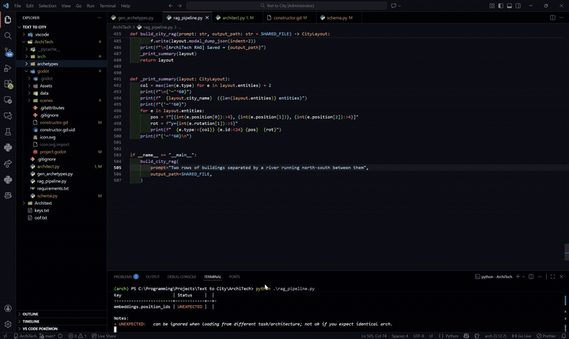
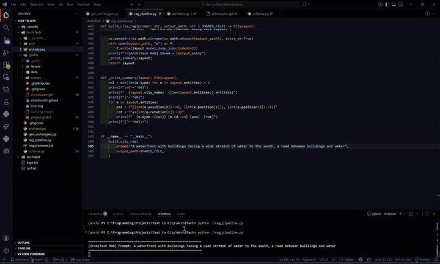

# ArchiTech — Text-to-3D City Pipeline

Turns a natural-language prompt (e.g. *"a road with buildings on both sides and a river with a bridge"*) into a structured, spatially-valid 3D city layout, ready to be rendered by a game engine.

> **Scope note:** This repo contains the LLM/backend pipeline I built as my contribution to a group project.

## What it does

1. **Planner** — a local LLM (Ollama, `qwen2.5:14b`) reads the prompt and produces a `SceneBrief`: zones, road plan, and spatial relationships. No coordinates yet.
2. **Placer** — a Groq-hosted LLM (`llama-3.3-70b`) converts the brief into exact grid coordinates (`CityLayout`), following strict spatial-translation rules (adjacency, "surrounding," "between," cardinal directions, etc.).
3. **Validator** — a pure-Python, deterministic reviewer (no LLM) checks the layout: correct entity counts, road adjacency, bridge-on-water constraints, symmetric placement for "both sides" prompts, and complete ring/square formations.
4. **Self-correction loop** — if validation fails, the specific issues are sent back to the Placer as a correction prompt, up to `MAX_REVIEW_RETRIES` times.
5. **RAG variant** (`rag_pipeline.py`) — instead of placing from scratch, retrieves the closest pre-built layout template ("archetype") via embedding similarity (`sentence-transformers`, with keyword fallback), then asks a modifier LLM to adapt it to the specific prompt. This significantly improved reliability on spatial phrasing the pure-generation approach struggled with (e.g. "surrounding," "on both sides").

Output is a `CityLayout` JSON file, consumed by the (separate, not-included) Godot renderer.

## Files

| File | Purpose |
|---|---|
| `architect.py` | Original pipeline: Planner → Placer → Validator, with retry loop |
| `rag_pipeline.py` | RAG-based pipeline: archetype retrieval → Modifier LLM → same validator |
| `gen_archetypes.py` | Generates the 15 handcrafted layout templates (row, crossroad, island, waterfront, etc.) used by the RAG pipeline |
| `schema.py` | Pydantic models for `SceneBrief`, `CityLayout`, `CityEntity`, `ReviewResult`, plus grid-snapping and overlap validation |

## Example Output

Prompt → JSON layout → rendered by teammate's Godot front-end (not included in this repo):

**Prompt:** *"Two rows of buildings separated by a river running north-south between them"*



**Prompt:** *"A waterfront with buildings facing a wide stretch of water to the south, a road between buildings and water"*



## Setup

```bash
pip install -r requirements.txt
cp .env.example .env
# then fill in your own GROQ_API_KEY_1 / GROQ_API_KEY_2 in .env
```

Requires a local [Ollama](https://ollama.com) instance running `qwen2.5:14b` for the Planner stage, and a [Groq](https://console.groq.com) API key for the Placer/Modifier stage.

## Run

```bash
python architect.py       # direct generation pipeline
python rag_pipeline.py     # RAG + archetype pipeline
```

Both write the resulting layout to `./godot/data/current_city.json`.